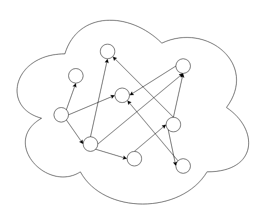
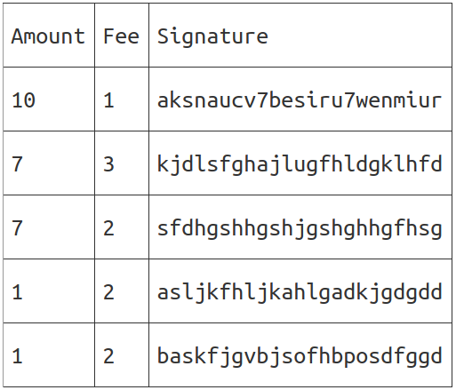
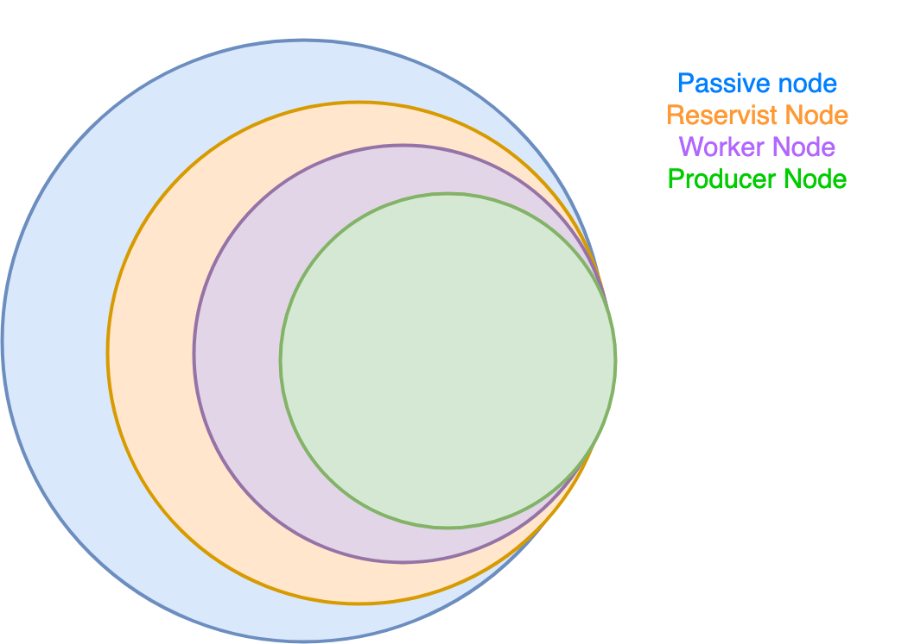
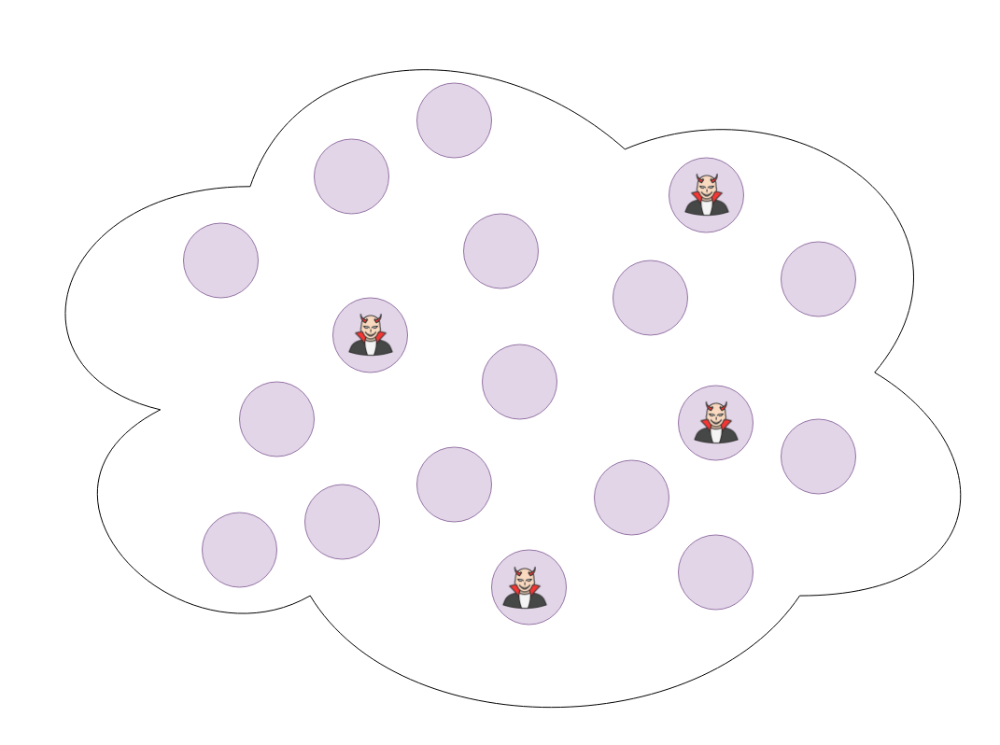
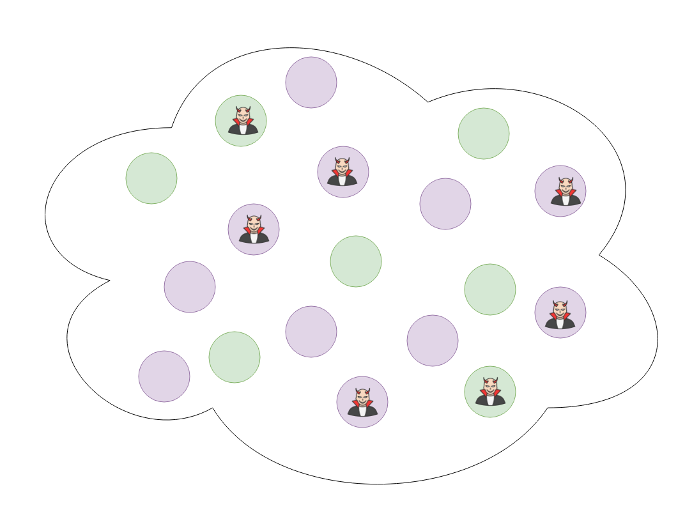
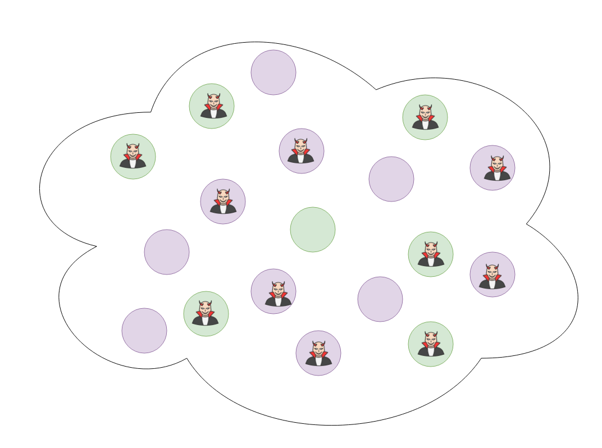
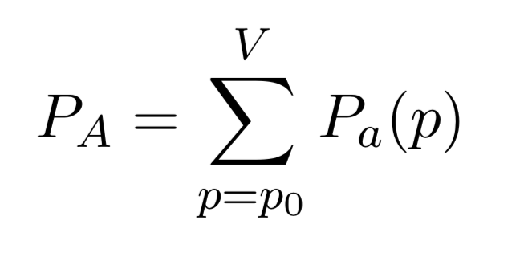
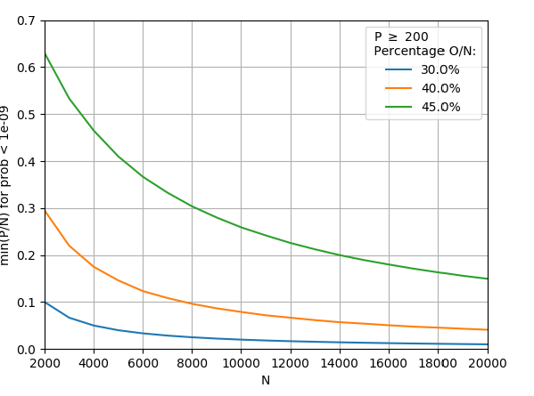
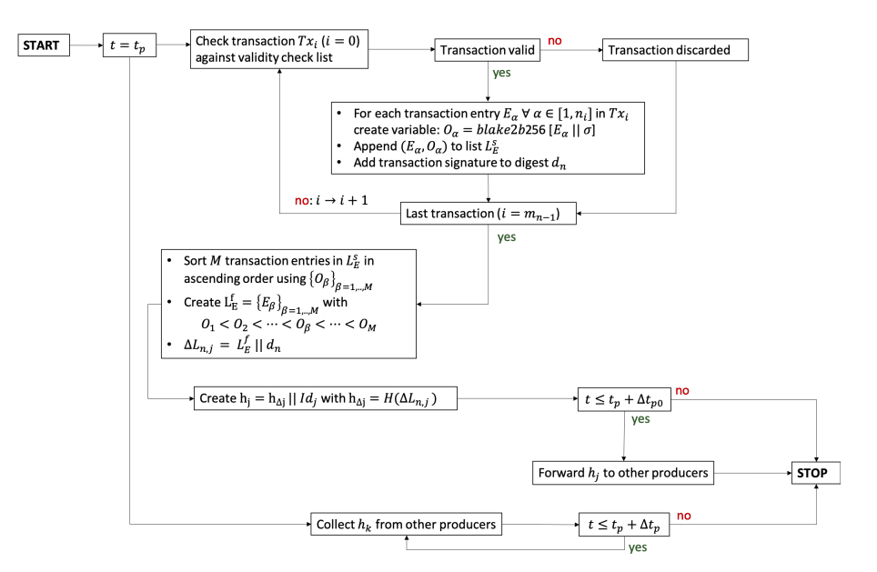
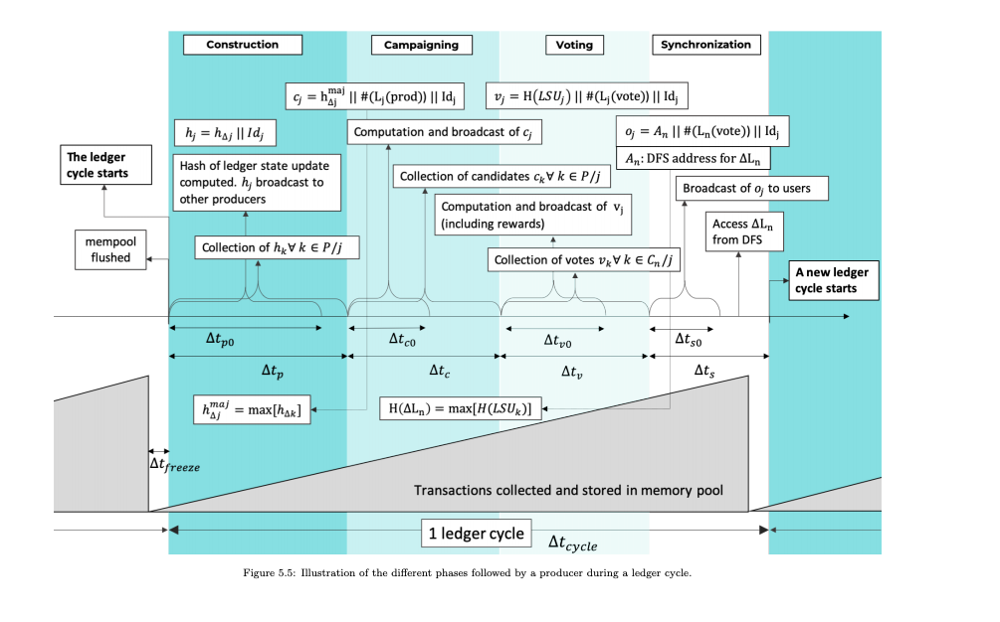

# Rasica Network

Developer Introduction

###### Created by [@TheNewAutonomy](https://github.com/thenewautonomy/)


---

# What is the
# <!--fit-->Rasica Network?

---

# Rasica Network 

* Probabilistic BFT Consensus
* Distributed FileSystem (DFS)
* Public and Confidential transactions

---

# What is 
# <!--fit-->Probabilistic BFT Consensus

---

# <!---fit--->A collaborative process in which nodes collectively vote on global state transitions

---
# Create Transaction
```
                                                                                                                   +--Confidential Entry-------------------+---------------+
+---Protocol Message-------------------------------------+-----------------+                                       |                                       |               |
|                                                        |                 |                                       |  value_commitment                     | M * 32 bytes  |
|   PeerID                                               | 60 bytes        |   +--Public Entry----+-----------+    |                                       |               |
|                                                        |                 |   |                  |           |    +-------------------------------------------------------+
+--------------------------------------------------------------------------+   |  Amount          |  32 bytes |    |                                       |               |
|                                                        |                 |   |                  |           |    |  bit_commitment                       | 32 bytes      |
|   CorrelationId                                        | 16 bytes        |   +------------------------------+    |                                       |               |
|                                                        |                 |   |                  |           |    +-------------------------------------------------------+
+--------------------------------------------------------------------------+   |  To Address      |  20 bytes |    |                                       |               |
|                                                        |                 |   |                  |           |    |  per_bit_blinding_factor_commitment   | 32 bytes      |
|   MessageType                                          | 2 bytes         |   +------------------------------+    |                                       |               |
|                                                        |                 |   |                  |           |    +-------------------------------------------------------+
+--------------------------------------------------------------------------+   |  From Address    |  20 bytes |    |                                       |               |
|                                                        |                 |   |                  |           |    |  poly_commitment_t1                   | 32 bytes      |
|   Signature                                            | 64 bytes        |   +------------------------------+    |                                       |               |
|                                                        |                 |   |                  |           |    +-------------------------------------------------------+
+--------------------------------------------------------------------------+   |  Transaction Fee |  32 bytes |    |                                       |               |
|--Transaction Message-----------------------------------------------------|   |                  |           |    |  poly_commitment_t2                   | 32 bytes      |
||                     |                                 |                ||   +------------------+-----------+    |                                       |               |
||                     |  Public Entries                 | N * 104 bytes  ||                                       +-------------------------------------------------------+
||                     |                                 |                ||   +--Contract Entry--+-----------+    |                                       |               |
||                     |                                 |                ||   |                  |           |    |  proof_of_share_tau                   | 32 bytes      |
||                     +---------------------------------------------------|   |  Amount          |  32 bytes |    |                                       |               |
||                     |                                 |                ||   |                  |           |    +-------------------------------------------------------+
||  Entries (N > 1)    |                                 |                ||   +------------------------------+    |                                       |               |
||                     |  Confidential Entries           | N * (104 bytes ||   |                  |           |    |  proof_of_share_mu                    | 32 bytes      |
||                     |                                 | + CallData)    ||   |  CallData        | Bytes > 0 |    |                                       |               |
||                     |                                 |                ||   |                  |           |    +-------------------------------------------------------+
||                     +---------------------------------------------------|   +------------------------------+    |                                       |               |
||                     |                                 |                ||   |                  |           |    |  aggregated_vector_polynomial_l       | k * 32 bytes  |
||                     |                                 |                ||   |  To Address      |  20 bytes |    |                                       |               |
||                     |  Smart Contract Entries         |  N*736 bytes   ||   |                  |           |    +-------------------------------------------------------+
||                     |                                 |                ||   +------------------------------+    |                                       |               |
||                     |                                 |                ||   |                  |           |    |  aggregated_vector_polynomial_r       | k * 32 bytes  |
|----------------------+---------------------------------------------------|   |  From Address    |  20 bytes |    |                                       |               |
||                                                       |                ||   |                  |           |    +-------------------------------------------------------+
||  Signature                                            |  64 bytes      ||   +------------------------------+    |                                       |               |
||                                                       |                ||   |                  |           |    |  a_prime_0                            | 32 bytes      |
|--------------------------------------------------------------------------|   |  Transaction Fee |  32 bytes |    |                                       |               |
||                                                       |                ||   |                  |           |    +-------------------------------------------------------+
||  Timestamp                                            |  4 bytes       ||   +------------------+-----------+    |                                       |               |
||                                                       |                ||                                       |  b_prime_0                            | 32 bytes      |
|--------------------------------------------------------------------------|                                       |                                       |               |
+--------------------------------------------------------------------------+                                       +---------------------------------------+---------------+

```

---

# Broadcast to network



---

# Deterministic Mempool

- Highest amount
- Highest fee
- Oldest timestamp
- Signature in alphabetical order



---

# Validation

---

# Peers in the validation process have 4 states

1. Passive Node
    - Connected to peer network
2. Reservist Node
    - Awaiting for admission to the validation pool
3. Worker Node
    - A node that is admitted to the validation pool
4. Producer Node
    - A subset of worker nodes who can contribute to production of ledger state updates

---

# Producer Selection

dfsHash(Δc-1) XOR PeerID

```
+----------------------+---------------------+----------------------+-----------------------+---------------------+----------------------+
|                      |                     |                      |                       |                     |                      |
|                      |                     |                      |                       |                     |                      |
|  dfsHash(Δc-1)       |  dfsHash(Δc-1)      |  dfsHash(Δc-1)       |  dfsHash(Δc-1)        |  dfsHash(Δc-1)      |  dfsHash(Δc-1)       |
|                      |                     |                      |                       |                     |                      |
|  cycle 2             |  cycle 3            |  cycle 4             |  cycle 5              |  cycle 6            |  cycle 7             |
|                      |                     |                      |                       |                     |                      |
+----------------------+---------------------+----------------------+-----------------------+---------------------+----------------------+

```

---

# Network Constitution


---

# Worker pool


---


# Worker pool


---

# Worker pool


---

# Malicious Nodes


---

# Worker pool



---

# Worker pool



---

# Worker pool



---

# 51% Attack Research



# <!--fit--> http://github.com/Rasica-network/51-percent-attack-research



---

# The Ledger Cycle

- Producers validate common sets of transactions from the mempool

- Each producer compiles a state delta and votes among its peers in the cycle to vote on the most popular delta produced by the set of producers.

---

# The Ledger Cycle



---

# State Update

When producers have voted and come to consensus on the most correct state update, a state delta update is broadcast to the rest of the network

```
 message Delta {
	bytes previous_delta_dfs_hash = 1;
	bytes state_trie = 2;
	bytes receipt_trie = 3;
	google.protobuf.Timestamp time_stamp = 4;
	repeated Transaction.PublicEntry public_entries = 5;
	repeated Transaction.ConfidentialEntry confidential_entries = 6;
	repeated Transaction.ContractEntry contract_entries = 7;
	repeated Transaction.CoinbaseEntry coinbase_entries = 8;
}
```

Who then clean the validated transactions from their mempool

---

# Consensus Cycle



---

# Integration with Solana tools

Developers will be able to use Rust for contract development and deployments.

---

# Native DFS access from KVM

Rasica users will have a unique ability to build contracts that will have read and write access to big data sets stored on DFS. Prefetch mechanisms and local DFS caches deliver a solution to data availability for virtual machines.

---

# Early Access Program

Sign up to the Rasica Network EAP

https://Rasicanet.org/eap

---

# Thanks

[twitter.com/thenewautonomy](https://twitter.com/thenewautonomy)
[github.com/thenewautonomy](https://github.com/thenewautonomy)
---